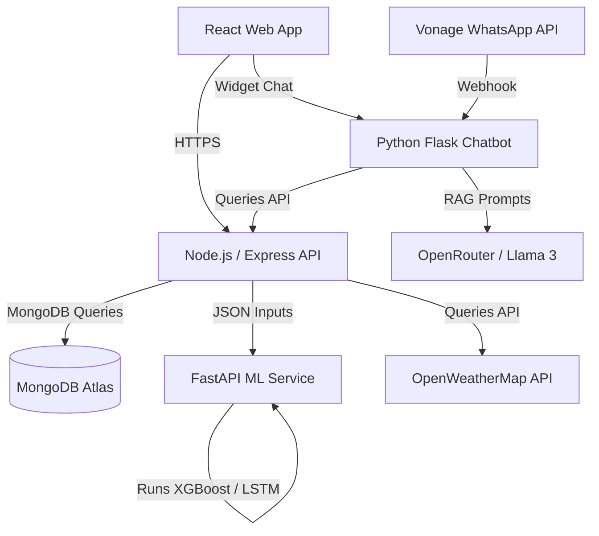

# DengueRadar — Live AI-Powered Dengue Risk & Early Warning System

<div align="center">
  
  
  
  
</div>

---

## Overview
**DengueRadar** is a state-of-the-art early warning and monitoring platform designed to predict, track, and alert citizens and medical authorities of dengue outbreaks across Sri Lanka. By combining real-time meteorological forecasts, historical case records, and demographic dynamics, DengueRadar uses Machine Learning models (LSTM & XGBoost) to forecast risk levels up to 2 weeks in advance.

---

## Features

-  **Interactive Risk Map**: Fully responsive Leaflet-based GeoJSON map displaying district-by-district risk scores.
-  **AI Predictions Engine**: Predicts upcoming case spikes and escalates risk levels ('Low', 'Moderate', 'High').
-  **AI WhatsApp Chatbot**: An integrated WhatsApp and Web Chatbot acting as an autonomous MOH Officer, powered by LLM RAG (Retrieval-Augmented Generation) and live ML predictions.
-  **Anti-Spam Early Warnings**: Automatically dispatches email and web alerts to citizens in escalating risk zones with a strict 7-day cooldown to prevent notification fatigue.
-  **MOH Officer Portal**: Dedicated officer dashboards featuring dynamic region filters, trend graphs, and instant CSV data export capabilities.
-  **Live Weather Integration**: Automatically fetches real-time humidity, temperature, and rainfall metrics for targeted areas to feed into the prediction models.

---

##  Architecture & Stack



- **Frontend**: React, Vite, Leaflet Maps, Recharts, HSL Dark-Mode theme.
- **API Gateway**: Node.js + Express, JWT authentication, Mongoose ORM.
- **Machine Learning**: FastAPI, Python, XGBoost, TensorFlow (LSTM), Scikit-Learn.
- **AI Chatbot**: Python, Flask, RAG (Retrieval-Augmented Generation), OpenRouter API, Vonage API.
- **Database**: MongoDB.

---

##  Quick Start Guide

This project utilizes **Git LFS (Large File Storage)** to handle model binaries (`*.keras`, `*.json`).

### 1. Install Prerequisites & Pull Models
```bash
# Install Git LFS (Ubuntu/Debian)
sudo apt install git-lfs

# Initialize & Pull model binaries
git lfs install
git lfs pull
```

### 2. Startup Services

Ensure your services are started in the following order:

#### A. Run the ML Prediction Service (FastAPI)
```bash
cd apps/ml-service
python -m venv venv
source venv/bin/activate
pip install -r requirements.txt
uvicorn app.main:app --reload --host 0.0.0.0 --port 8000
```

#### B. Start the Node.js API Gateway
```bash
cd apps/backend
npm install
npm run dev
```

#### C. Start the AI Chatbot Server
```bash
cd apps/dengue_whatsapp_chatbot
python3 -m venv venv
source venv/bin/activate
pip install -r requirements.txt
python3 app.py
```

#### D. Fire up the React Dev Server
```bash
cd apps/frontend
npm install
npm run dev
```

---

##  Project Repository Structure

- `apps/frontend/`: React components, custom hooks, and pages (Home, MOH Dashboard).
- `apps/backend/`: Authentication, weather fetching cron jobs, prediction database controllers.
- `apps/ml-service/`: FastAPI wrappers exposing XGBoost classifier & LSTM predictions.
- `apps/dengue_whatsapp_chatbot/`: Python Flask webhook for WhatsApp and React chat widget, featuring LLM RAG pipelines.
- `ml-pipeline/`: Python notebooks, dataset preprocessors, and feature encoders.
- `SETUP_GUIDE.md`: Deep technical walkthrough on setup, environment variables, and local testing.

---
